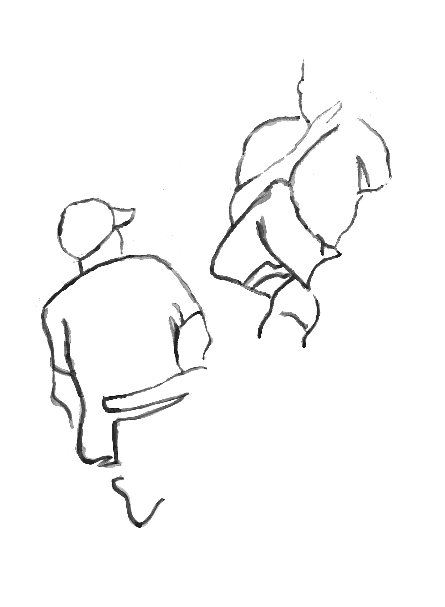

# Homeless-Hub

The first step in empowering any community to change their lives is to create a space where people can develop and crystallise their OWN understanding of the problem. 


In this Gitbook, as well as recording the project's progress, we will be experimenting with approaches to attribution, and with methods of recording the contributions of those involved. This applies both to the contributions of the proposal team, and to the contributions of of those who take part in the project.


