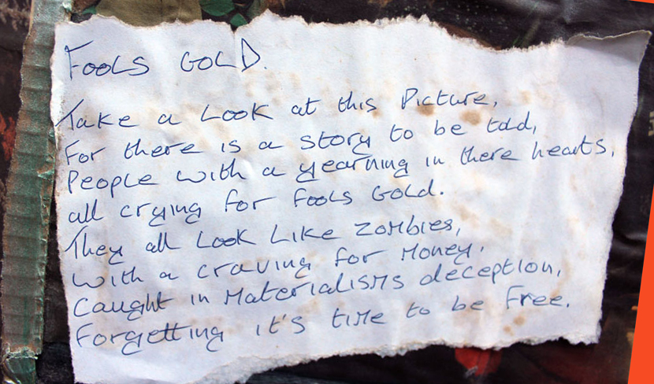

# Asset-Based Community Development (ABCD)

In this project, we specifically wanted to focus from the start on an asset-based approach. We know from experience that projects that engage homeless and ex-homeless people often do not do this. They tend to focus instead on lack - both what they believe we lack as individuals, and not really recognising us as a community of experience. It’s true, of course, that “homelessness is an experience, not an identity”, and it’s important to say that – but while you are homeless, you often find support, solidarity and a sense of community with other homeless people. And if you then get housed, homelessness is an experience that has persistence. It stays with you; and while it doesn’t completely shape you, it definitely influences you. The Republic of the Homeless is one that you have citizenship of for life.

Sometimes asset-based approaches get criticised cos people say they can obscure the very real barriers that people face, in favour of suggesting it’s all sunshine, rainbows and hard-won assets of knowledge and strength and lived experience. We get that – but we don’t think ABCD (Asset-Based Community Development) has to be that way. Maybe it’s about who is in control of the reframing.

<figure><figcaption></figcaption></figure>

So in this project we didn’t want to completely reframe lived experience of homelessness as simply “an asset” – it’s more complex than that. But we did want to make space for recognising the assets that are there; especially in a project that’s all about assets, what has value, what we can draw on

During the project the group said, at various points, that homelessness gives us an insight into some of the issues around wealth. It gives us a resourcefulness around money – being homeless is really hard work, and you need to be really resourceful – and it gives us a sense of the value of decentralised community, mutual aid, and not relying on leaders but on all of us together. Like they used to say: no justice – just us. And in particular, homelessness gives us an understanding that wealth is often a flash in the pan, and cannot be relied upon - it can just disappear, so your wealth is something that it’s unwise to base your identity on. This is where the main message of our final art piece (“Don’t count your chickens: homelessness can happen to anyone”)  comes from.

<figure><figcaption>
poem by Roger, too many years ago
</figcaption></figure>

