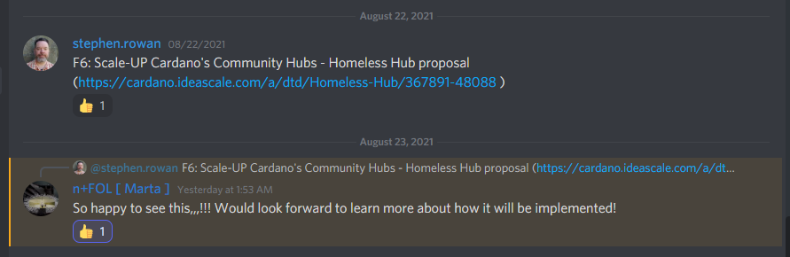
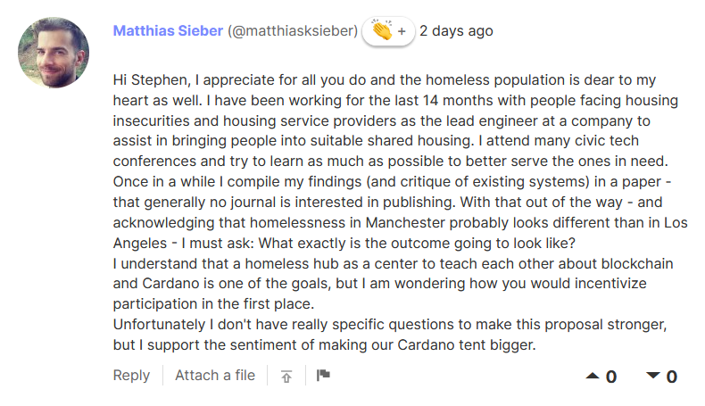
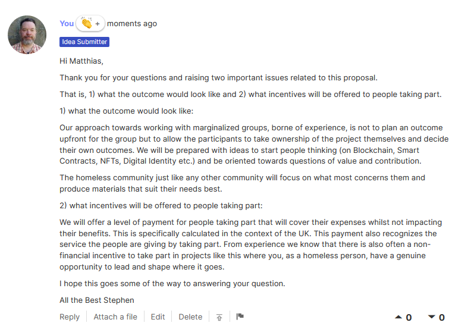
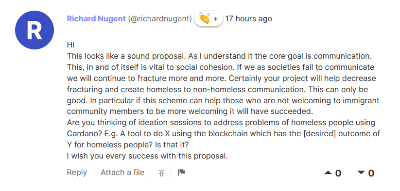
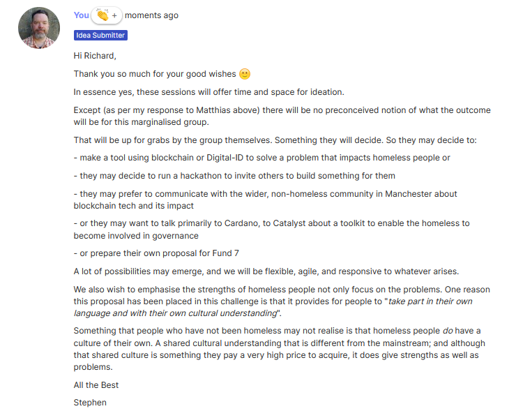

# Fund 6 Proposal Process

## August 22nd to 26th - Submission of Proposal 

## Comments

#### Discord Context



### Matthias Sieber \(@matthiasksieber\) kudos icon + 2 days ago

Hi Stephen, I appreciate for all you do and the homeless population is dear to my heart as well. I have been working for the last 14 months with people facing housing insecurities and housing service providers as the lead engineer at a company to assist in bringing people into suitable shared housing. I attend many civic tech conferences and try to learn as much as possible to better serve the ones in need. Once in a while I compile my findings \(and critique of existing systems\) in a paper - that generally no journal is interested in publishing. With that out of the way - and acknowledging that homelessness in Manchester probably looks different than in Los Angeles - I must ask: What exactly is the outcome going to look like? I understand that a homeless hub as a center to teach each other about blockchain and Cardano is one of the goals, but I am wondering how you would incentivize participation in the first place. Unfortunately I don't have really specific questions to make this proposal stronger, but I support the sentiment of making our Cardano tent bigger.

### Stephen Response to Matthias 

Hi Matthias,

Thank you for your questions and raising two important issues related to this proposal.

That is, 1\) what the outcome would look like and 2\) what incentives will be offered to people taking part.

1\) what the outcome would look like:

Our approach towards working with marginalized groups, borne of experience, is not to plan an outcome upfront for the group but to allow the participants to take ownership of the project themselves and decide their own outcomes. We will be prepared with ideas to start people thinking \(on Blockchain, Smart Contracts, NFTs, Digital Identity etc.\) and be oriented towards questions of value and contribution.

The homeless community just like any other community will focus on what most concerns them and produce materials that suit their needs best.

2\) what incentives will be offered to people taking part:

We will offer a level of payment for people taking part that will cover their expenses whilst not impacting their benefits. This is specifically calculated in the context of the UK. This payment also recognizes the service the people are giving by taking part. From experience we know that there is also often a non-financial incentive to take part in projects like this where you, as a homeless person, have a genuine opportunity to lead and shape where it goes.

I hope this goes some of the way to answering your question.

All the Best Stephen

### Richard Nugent \(@richardnugent\) kudos icon + 17 hours ago

Hi This looks like a sound proposal. As I understand it the core goal is communication. This, in and of itself is vital to social cohesion. If we as societies fail to communicate we will continue to fracture more and more. Certainly your project will help decrease fracturing and create homeless to non-homeless communication. This can only be good. In particular if this scheme can help those who are not welcoming to immigrant community members to be more welcoming it will have succeeded. Are you thinking of ideation sessions to address problems of homeless people using Cardano? E.g. A tool to do X using the blockchain which has the \[desired\] outcome of Y for homeless people? Is that it? I wish you every success with this proposal.

### Stephen Response to Richard

