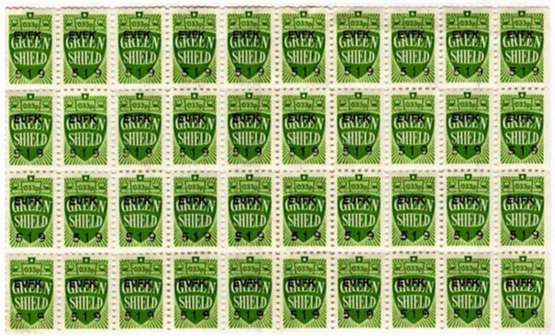
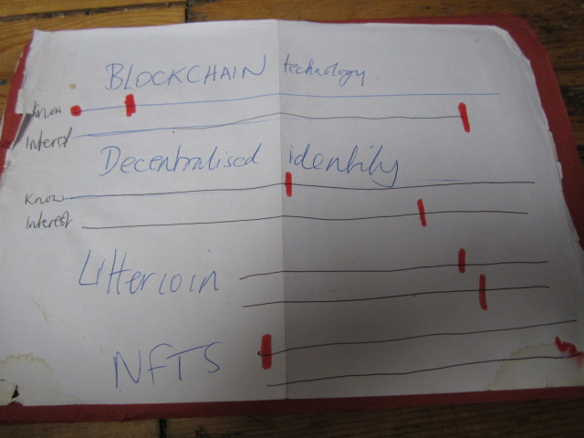

# Session 2, 7th March 2022

## **PEOPLE**

**9 people took part:** Julie, Joe, Kev, Jack, Chris, Mark, Ian, Darren, and Vanessa.

### **1)** MONEY, TOKENS AND CONTROL

Is "value" the same thing as "worth"? We talked last week about how tough times or homelessness can make you value certain objects or things differently. This can lead to the weird sensation that Vanessa has christened **“worth-dissonance**” – **the feeling when you see that society values a thing very differently from how you value it.**&#x20;

So we listed some stuff that we think is way overpriced, or way underpriced, according to our individual sense of value.&#x20;

#### Overpriced

Phone bills; Holidays and city breaks; diamonds; TVs; footie players esp. Man Utd; cut flowers especially on Valentines Day, they exploit people because everyone wants roses on that day; same with easter eggs, they're overpriced for the amount of chocolate

#### Underpriced

Love and affection; wages; time !

#### Then we talked about - if you were going to design a value-system, what would be worth a lot, and what would be worth nothing?

Two opnions about buying flowers - they're dead in a day. plastic ones are better - things that last should be worth more than things that don't. But on the other hand, maybe real things should be worth more than fake ones?&#x20;

So maybe we could have a system that values:\
\
&#x20;\- time (whether things last)?\
&#x20;\- realness?\
&#x20;\- popularity? (though we don't like this idea much - when things are valued just because they are popular, it's a bit shallow)\
&#x20;\- equality - as in, everybody having a say in what things are worth? Or maybe, as in Everybody is actually just valued the same, let's stop drawing distinctions and making one person or thing officially "better" than another. People will have their preferences and that's fine, but one person's or one group's preferences shouldn't form an actual value system for everyone.\
&#x20;\- so, everyone being able to have their own view of what things are worth, and that being reflected in the system?\
&#x20;\- judgement? expertise? experience? Different kinds of knowledge about a thing affect what it's worth to you - like if you know its back-story, or you know how to use it, etc\
&#x20;\- quality and functionality, not brand - if something works, it doesn't matter if it's not a famous brand\
&#x20;\- STOP CONFORMING! basically.

### 2) HAVE YOU EVER USED A TOKEN?

Tokens are thing that are not money, but function a bit like money - they're a way to exchange value, so you use them like currency. We realised there are loads:

&#x20;\- sure start/milk tokens\
&#x20;\- gift cards, book tokens\
&#x20;\- a present\
&#x20;\- doing a favour or a job for someone\
&#x20;\- a token of love (awww)\
&#x20;\- arcade token, casino chips\
&#x20;\-  cigarettes or tobacco\
&#x20;\- time spent doing something for someone - time bank\
&#x20;\- supermarket loyalty cards\
&#x20;\- green shield stamps\
&#x20;\- bartering and swapping generally - sweeties when you're a kid

We noted that you can give _**or**_** ** receive a token, so you can sometimes decide what it is worth (receiver usually decides? We weren't totally sure on that - if the giver has the most power in the transaction, then they decide...) And we noted that its value might depend on levels of kindness in the society - if people are generally kind then some of these things are just normal, and don't have an extra value? And it depends on what power we have - if you are powerful, you are the one who decides what it's worth. \
\
We also raised the issue that maybe we don't always _**want**_ to reduce these things to a specific value. If you do somebody a kindness, but you're thinking "What is this worth?" then it skews it, or even spoils it.\
&#x20;

### **3) WHAT DO YOU KNOW?**

We did an exercise to find out our "baseline" - how much do we, as a group, already know about certain things, and how interested are we in knowing more?\
Below, you can see how it looked on paper - the first line is how much we know, the second is how interested we are.

**Blockchain** - we know a little bit, mostly from what we read in the papers. About a 2 or a 3.\
We're very interested to learn more: a 10.\
\
**Decentralised identity** - we understand a bit about this. We didn't know the term for it, but once it's explained what it is, we get the concept. Probably because as people with experience of homelessness, we know some of the barriers around proving identity without an address. So - about a 5.\
We're pretty interested to learn more - maybe a 7 or 8

**Littercoin -** this is a Cardano token that is being developed, that Vanessa is aware of - they would be able to talk to the group about what tokens are. Vanessa explained it a bit, so as a group we know something about it now - maybe a 7\
We're interested to know more - an 8.

**NFTs** - a couple of us have heard the phrase, but we are all quite confused by it and don't feel like we know what they are. Maybe a 1, or even 0.\
But we are pretty interested to find out, just out of curiosity. Maybe a 9.

### 4) INTRO TO DISTRIBUTED LEDGER TECHNOLOGY

We talked about what a blockchain actually is; outlined a few things it can be used for; and talked briefly about the difference between proof of work and proof of stake. More on this next week.

\
We used this diagram, from Euromoney Learning: (note: we are nowt to do with them, just found it online and thought it was useful - so credit where due - here's the link [https://www.euromoney.com/learning/blockchain-explained/what-is-blockchain](https://www.euromoney.com/learning/blockchain-explained/what-is-blockchain)

****
