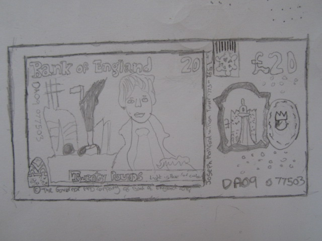

# Session 4, 21st March 2022

### PEOPLE

**10 people took part:** Julie, Jack, Chris, Kev, Darren, Joe, Steven, Ian, Barry and Vanessa.

### WARM-UP DRAWING GAMES

People had said they were interested in trying some drawing, so we did a few classic drawing warmup games.

**1) 20-second poses**\
Someone in the group strikes a pose, and holds it for 20 seconds only. Everyone else has to try to draw them, capturing the basic feel of their pose as quickly as possible. Then they move to a new pose. Here are some results:\
\
**2) Drawing blindfold**\
Pair up with someone, and draw their face, but without looking at the paper at all - keep your eyes on their face. (We found it really hard not to look down!) Here are some results:\
\
**3) Wrong-hand drawing**\
All draw the same thing (we chose to draw a tree) but using your non-dominant hand. So if you're right handed, use your left; and vice versa. Here's some of ours:

<figure><figcaption></figcaption></figure>

 

<figure><figcaption></figcaption></figure>

 

<figure><figcaption></figcaption></figure>

 

<figure><figcaption></figcaption></figure>

### COPYING, DRAWING, AUTHENTICITY

We had a quick chat about NFTs and the whole idea of "fungible" and "non-fungible", and how generative art in particular is a series of iterations on a starting point. This led us to talking about what we mean by things like "real" or "original" or "authentic". We then had a play around with some of these ideas practically:\
\
**1) Copy and pass**\
Each person starts wth a piece of paper. Draw something on one end of your your paper - anything you like, but make it something fairly simple (we had a tree, an eye, a glass, etc) and pass it round the circle to your left. Then take the drawing you have just recieved from the person on your right, and copy it as closely as you can (you can do it on the same piece of paper, or a new one). When you're done, pass your drawing to your left, and repeat the process. At the end, compare the original with the other versions.\
We found it was bizarre trying to copy the drawing, not draw our own idea of what the thing looks like; and it made us notice details of how the other person had drawn it. Here's one of our results: the eye.

<figure><figcaption></figcaption></figure>

 

<figure><figcaption></figcaption></figure>

 

<figure><figcaption></figcaption></figure>

**2) Draw a Twenty**\
Take a £20 note, and draw it. You can choose whether to try and be accurate, or whether to play with it. Here are some of ours.

<figure><figcaption></figcaption></figure>

 

<figure><figcaption></figcaption></figure>

 

<figure><figcaption></figcaption></figure>

 

<figure><figcaption></figcaption></figure>

 

<figure><figcaption></figcaption></figure>

 

<figure><figcaption></figcaption></figure>

<figure><figcaption></figcaption></figure>

**FUNGIBILITY, COPYING, VALUE**

These drawing games led us into a conversation about some of the ideas behind NFTs.\
\
We looked at what relation "fungibility" and "non-fungibility"  might have to value. (A £20 note is fungible - it can be replaced by, and has the same value as, any other £20 note - but if a famous artist doodles on a £20, that £20 becomes non-fungible, and also probably becomes worth more)...

... we discussed whether a copy can have value, or whether originality and uniqueness should be valued; and to what extent you can base your work on something else before it becomes a "copy" ...

... and we thought about what our "non-fungibility" as humans might say about our value.&#x20;

> _**"When someone doesn't value you, they're seeing you as being the same as every other person in your group - say, every other homeless person. They're seeing you as fungible."**_

_****_

